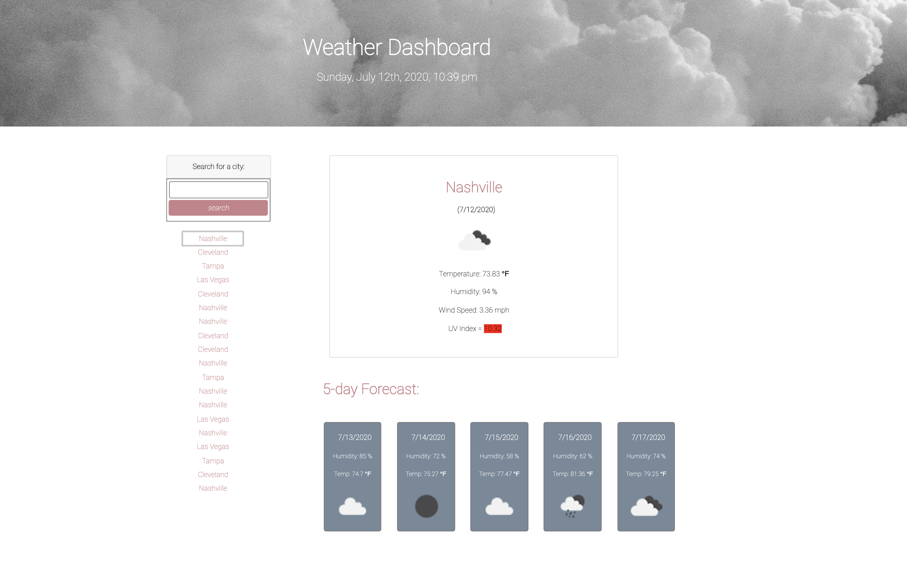

# Weather Dashboard

## Purpose
A weather dashboard that forecasts the current and future weather conditions for a city when a user searches for that city. That city is added to the user's search history. When the user views current weather conditions for the city searched, they are presented with the city name, date, an icon representation of weather conditions, the temperature, the humidity, the wind speed, and the UV index. The user is presented with a color that indicates whether the UV index conditions are favorable, moderate, or severe.  When the user views the future weather conditions for the city, they are presented with a five day forecast that displays the date, an icon representation of weather conditions, the temperature, and the humidity. When the user clicks on a city in their search history, they are again presented with current and future conditions for that city

## Built With
* HTML
* CSS
* JavaScript
* Bootstrap
* moment.js
* jQuery

## Website
https://mallynnk.github.io/weather-dashboard/

## Screenshot
 

## Contribution
Mallory Korpics

